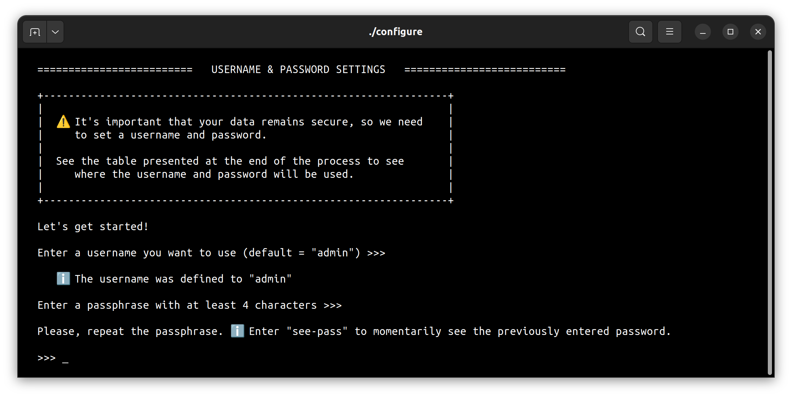
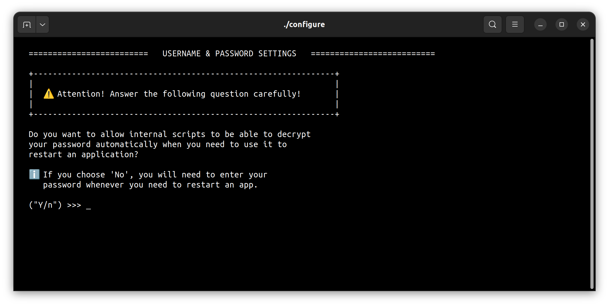
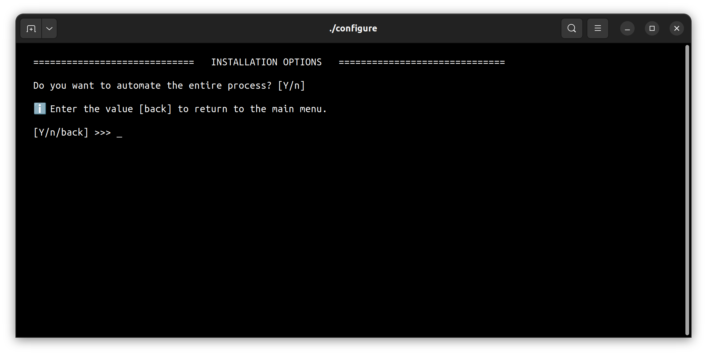
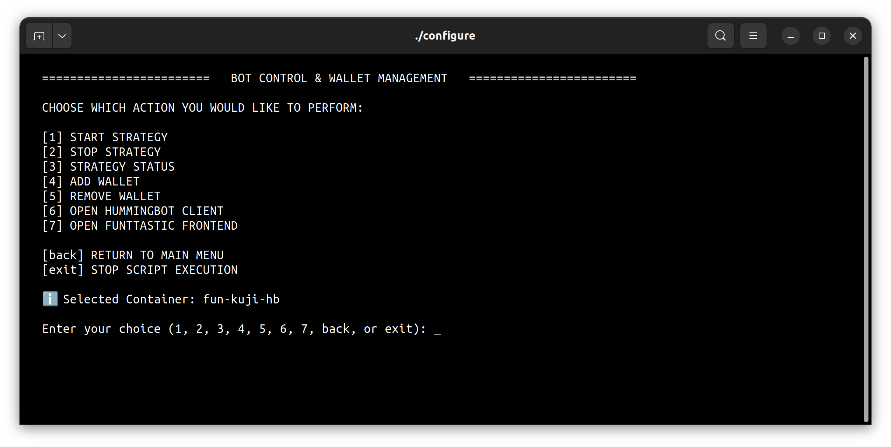
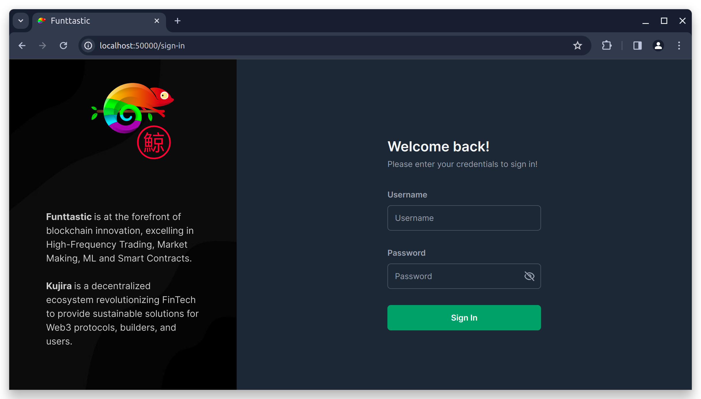
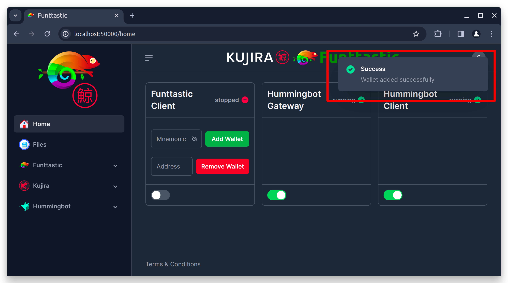
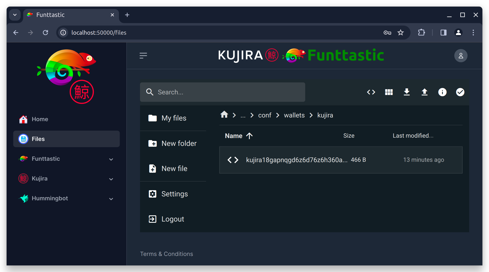
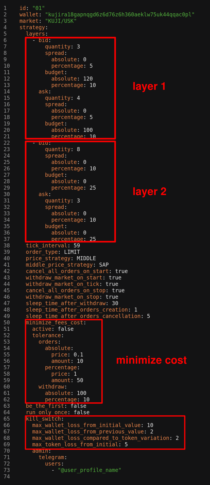
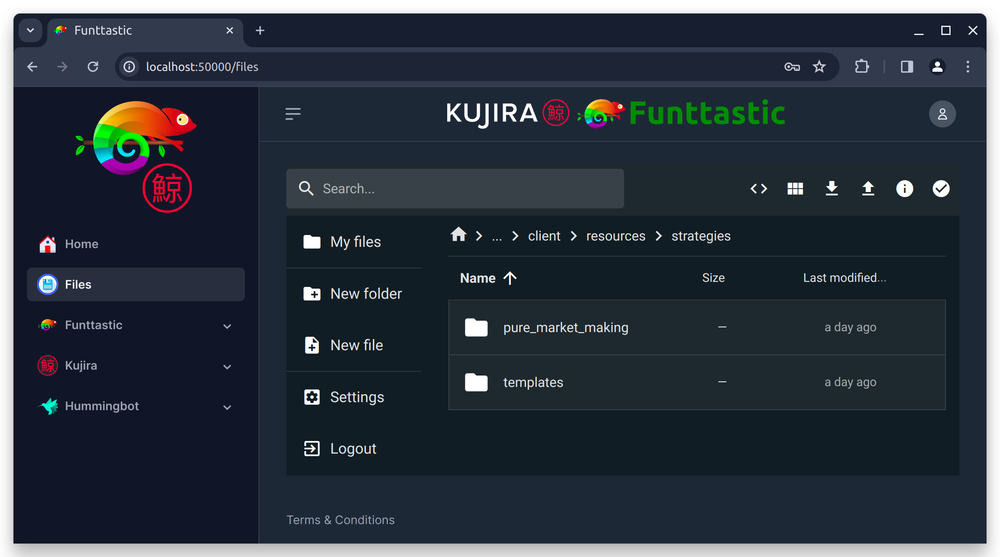

# Funttastic + Kujira + Hummingbot

## Hummingbot Installation Guide

It's very recommended to watch this video from the Hummingbot Foundation and their installation guide:

- <a href="https://docs.hummingbot.org/installation/" target="_blank">Hummingbot Docs</a>
- <a href="https://www.youtube.com/watch?v=t3Su_F_SY_0" target="_blank">Hummingbot Guide (Video Tutorial)</a>
- <a href="https://www.youtube.com/watch?v=NubBPj3N0RE" target="_blank">Kujira Connector for Hummingbot (Video Demonstration)</a>

## Prerequisites:

- \*nix OS (Linux, Unix, macOS) or <a href="https://learn.microsoft.com/en-us/windows/wsl/install" target="_blank">WSL</a> (for Windows)
- <a href="https://docs.docker.com/engine/install/" target="_blank">Docker</a>
- <a href="https://www.coingecko.com/en/api/pricing" target="_blank">CoinGecko API Key</a>
  - You will need a CoinGecko API key so the trading bot can get up-to-date information about tokens and markets, such as the current prices. Access the link to create a demo account and get a free API key.
- Kujira wallet and mnemonic
  - You will need a Kujira wallet and its mnemonic. You can create a new wallet using wallet apps like: <a href="https://www.keplr.app/download" target="_blank">Keplr</a>, <a href="https://sonar.kujira.network/" target="_blank">Sonar</a>, <a href="https://setup-station.terra.money/" target="_blank">Station</a>, <a href="https://www.leapwallet.io/download" target="_blank">Leap</a> and <a href="https://www.xdefi.io/" target="_blank">XDEFI Wallet</a>.
- (Optional) <a href="https://core.telegram.org/bots/features#botfather" target="_blank">Telegram bot</a>
  - You can operate your bot through Telegram, for that you need to <a href="https://core.telegram.org/bots/features#botfather" target="_blank">create a bot</a> and a new channel.
  - You will need the telegram bot token and the channel chat id.

## Installation


<details>
<summary>
  <span style="font-size:22px; font-weight:bold">Cloning Repository</span>
</summary>

#### Step 1 - Install Git
Install GIt to be able to clone the repository:
- Linux - Debian / Ubuntu / WSL:
```
  sudo apt install git
```
- Linux - Fedora:
```
  sudo dnf install git
```
- Linux - CentOS / RHEL:
```
  sudo yum install git
```
- macOS:
```
  brew install git
```

#### Step 2 - Cloning Repository
Open the shell terminal, use the "cd" command to navigate to the folder where you want to clone the repository and run the command below:
```
git clone https://github.com/funttastic/kujira-quickstart-guide.git
```
</details>

<details>
<summary>
  <span style="font-size:22px; font-weight:bold">Opening Script Main Menu</span>
</summary>

#### Step 1 - After cloning the repository
Open the repository folder with the command below::
```
cd kujira-quickstart-guide
```

#### Step 2 - Start the installation helper script
Using the command below, start the script that will help you perform the installation:
```
./configure
```
When you run the script, you will see the main menu screen as shown below:

</details>

<details>
<summary>
  <span style="font-size:22px; font-weight:bold">Installation Steps</span>
</summary>

#### Step 1 - Select the installation option from the main menu
> As shown in the image below, select the **[1] INSTALL** option by typing "1" and press Enter.


#### Step 2 - Set username and password
> Set your custom username or press Enter without typing anything to set "admin". Then type your password twice to set it. Set a strong password, longer than 4 digits but easy to remember.


#### Step 3 - Question that must be answered carefully
> The next question must be answered carefully. This option affects security or ease of use.


#### Step 4 - Table to show credential usage
> A table will be shown to inform where the credentials will be used. Press any key to continue.


#### Step 5 - Default installation settings?
> You will be asked if you want to automate the entire installation process.
>
> If you choose "Yes", which is the recommended option, or just press Enter without typing anything, the installation will be done using default settings and will begin immediately.
>
> If you choose "No", you will need to answer further questions to create the entire installation configuration and at the end you can review the settings and then press Enter once again for the installation to begin.

> If you choose automated installation mode, the process will start as shown below, otherwise you will be asked further questions:

</details>

<details>
<summary>
  <span style="font-size:22px; font-weight:bold">Opening The Frontend</span>
</summary>

#### Step 1 - From the main menu, select the Actions option
> Select the **[3] ACTIONS** option by typing "3" and press Enter.


> Select the Docker container that was created during installation.
>
> The default name is **fun-kuji-hb** - if you defined a different name during installation, type that name and press **Enter**, but if you didn't define a different name or are unsure, just press **Enter** to use the default name.:


> To open the Frontend, select the **[7] OPEN FUNTTASTIC FRONTEND** option by typing "7" and press **Enter**.


> When you choose the option to open the Funttastic Frontend, it will open in your web browser, or you can use the URL http://localhost:50000/.
>
> You will see a screen as shown below.
>
> Enter your username and password defined during installation.


> After you log in, you will see the screen below:

</details>

<details>
<summary>
  <span style="font-size:22px; font-weight:bold">Adding Wallet</span>
</summary>

#### Step 1 - Adding Wallet With Mnemonic
>
> When you created your wallet, a set of words was generated, probably 12 words. This set of words is called **Mnemonic**.
>
> In the **mnemonic** field, highlighted in the image below, add your wallet mnemonic and click the **Add Wallet** button:
>
> 
>
> After you click on the **Add Wallet** button, wait a few seconds until a pop-up window appears with the message **"Wallet added successfully"**, as you can see in the image below, indicating that the wallet has been added and can now be used.
>
> 

#### Step 2 -Confirming Wallet Addition
> If you want, you can confirm the wallet addition using Filebrowser. To do this, in the Frontend left side menu, choose "Files", enter your username and password to log in:
>
> 
>
> When you add a wallet, it will be added to the Hummingbot Gateway and Hummingbot Client files.
>
> In Hummingbot Gateway, for each wallet added, there will be a .json file in the directory
>
>> **shared/hummingbot/gateway/conf/wallets/kujira**
>
> Like this:
> 

> In the Hummingbot Client, when you add a wallet, it will be added to the **mainnet** and **testnet** networks in the **shared/hummingbot/conf/gateway_connections.json** file and due to how the Hummingbot Client works, whenever you add a new wallet to the same chain, this new wallet will replace the wallet that was previously added, so for the Hummingbot Client, each chain can only have one wallet, but for the Hummingbotateway, there can be indefinite wallets added.
> Unlike **Hummingbot Client**, **Funttastic Client** will be able to handle all the wallets you have added to **Hummingbot Gateway**.
</details>

<details>
<summary>
  <span style="font-size:22px; font-weight:bold">Configuring Strategy & Workers</span>
</summary>

#### Step 1 - Go To Strategy Configuration Files Directory
> Using Filebrowser through Frontend, access the following directory to access the strategy configuration files:
>
>> shared/funttastic/client/resources/strategies/pure_market_making/1.0.0
>
> There you can configure your Supervisor (`supervisor.yml`) and your workers (`workers/01.yml`, etc.).
>
> 
>
> You can use the `workers/common.yml` file if you want a configuration to be replicated to all your workers.
If a specific worker has a different configuration, the worker configuration will then apply.
>
> 

#### Step 3 - Configuring A Worker
> By default, there are already configuration files for three workers in the **workers** folder.
>
> If you want more workers, just duplicate any of the worker configuration files and change the **id** in the settings within the file to an id that is not in use.
>
> For both the file names and their internally defined ids, you can define whatever name you want, just keep the **.yml** extension.
>
> If you don't want to use any of your workers, you don't need to remove their configuration files, just disable it in the **supervisor** configuration file, as we will see later.
>
> But if you want to completely delete the configuration file of one of the workers, no problem, you can remove it. Just make sure to disable his **id** in your **supervisor** settings.
>
> When you open some **worker** configuration file, you will see something like below:
> 
> 
>
> In the other image below, there is an example of a configured worker.
>
> Below the image read some explanations about some defined parameters:
> 
> 
>
> **Line 1**: **id** - here you must define the **id** of the worker. For simplicity, a numeric **id** was defined there, but you can define any name you want, just avoid special characters and spaces.
>
> **Line 2**: **wallet** - here you must add the public key of your wallet. This public key must be derived from the same **mnemonic** that you used or will use to add your wallet through **Add Wallet** on the **Home** page of the frontend.
>
> **Line 3**: **market** - here you must define the market in which this worker will work. In this example, the **KUJI/USK** market was defined. The markets you will be able to trade on will be the markets available for **mainnet** and **testnet** on **Kujira**'s **FIN** at https://fin.kujira.network/. The name pattern normally consists of two symbols written in capital letters separated by the symbol **"/"**. If in doubt, open the market on **FIN** and look at the name of the pair in the page title.
>
> > **LAYERS**:
> >
> > See in the image above that 2 layers were defined. The main reason for allowing the creation of multiple layers is to define different spread levels for the same worker. You can add as many layers as you want.
> >
> > If you want to add more layers, copy another existing layer and paste it below it and then change the values. If you want to deactivate a layer without deleting it completely, just comment on the layer's lines by adding the symbol **"#"** at the beginning of its lines, on the left side.
> >
> > Each layer has a "bid" side and an "ask" side. If you want, you can define different **quantity**, **spread** and **budget** values between sides.
> > 
> > Some settings can be made using **absolute** values or **percentage** values. Absolute values will prevail over percentage values. To understand better, consider for example the **spread** configuration on the **bid** side of the layer 1 - if you define a value greater than zero for **absolute**, regardless of the value you define in **percentage**, the **absolute** value that will be considered, so if you want the percentage value to be considered, set the **absolute** value to **0** (zero) or **null**.
> 
> **Layer 1 (Line 6 to 21)** 
>
> > **Summary**
> >
> > In this example configuration, **layer 1** is saying:
> >
> > Create **3** buy orders, with each order having an **amount** of **40** (120 / 3 = 40) USK and the **prices** of the orders must be at a distance of **5%** in relation to the market price.
> >
> > Create **4** sell orders, with each order having an **amount** of **25** (100 / 4 = 25) KUJI and the **prices** of the orders must be within a distance of **5%** in relation to the market price.
>
> To understand in detail, look at **layer 1** - see that for **bid** the value **3** was defined for **quantity**, the value **0** for **spread.absolute**, the value **5** for **spread.percentage**, the value **120** for **budget.absolute** and the value **10** for **budget.percentage**.
>
> As explained previously, if the **absolute** value is greater than zero, it will be considered and the percentage value will be ignored.
>
> > **Bid Side**
> >
> > In **spread**, as the value **0** was defined for **absolute** and the value **5** for **percentage**, it means that the spread will be a percentage, that is, the orders will have their **prices** defined with a percentage distance in relation to the market price, in this example **5%**. If a value greater than zero had been set for **spread.absolute**, the distance from the market price would be calculated using a fixed value.
> >
> > In **budget**, both for **absolute** and **percentage** values greater than zero are defined, but the percentage value will be ignored, so the **budget** considered will be **120** tokens USK. If **budget.absolute** had been set to **0** or **null**, the **budget** would be **10%** of the total amount of USK tokens in your portfolio.
> >
> > In **quantity** the value **3** was defined, so the **budget** defined for **120** would be divided into 3 parts, so each purchase order (**bid**) of **layer 1** will have an **amount** of **40 USK**.
>
> > **Ask Side**
> >
> > In **spread**, the settings are identical to what was configured for the **bid** side, so the explanation is the same.
> >
> > In **budget**, the explanation is almost the same as the explanation given for the side **bid**, the difference is the amount. Now there are **100** USK tokens that will be divided by the number of orders that will be created.
> >
> > In **quantity** the value **4** was defined, so the **budget** defined for **100** would be divided into 4 parts, so each sell order (**ask**) of **layer 1** will have an **amount** of **25 USK**.
>
> **Layer 2 (Line 22 to 37)**
>
> > **Summary**
> >
> > In this example configuration, **layer 2** is saying:
> > 
> > Allocate **25%** of the portfolio's total free **USK** and divide this allocated amount into **8** equal parts (orders) and the **prices** of the orders must be at a distance of **10%** in relation to the market price.
> >
> > Allocate **25%** of the total free **KUJI** in the portfolio and divide this allocated amount into **3** equal parts (orders) and the **prices** of the orders must be at a distance of **10%** in relation to the market price.
> >
> To understand in detail, look at **layer 2** - See that for **bid** the value **8** was defined for **quantity**, the value **0** for **spread.absolute**, the value **10** for **spread.percentage**, the value **0** for **budget.absolute** and the value **25** for **budget.percentage**. Also see that for **ask** the value **3** was defined for **quantity**, the value **0** for **spread.absolute**, the value **10** for **spread.percentage**, the value **0** for **budget.absolute** and the value **25** for **budget.percentage**.
>
> As explained previously, if the **absolute** value is greater than zero, it will be considered and the percentage value will be ignored.
>
> > **Bid Side**
> >
> > In **spread**, as the value **0** was defined for **absolute** and the value **10** for **percentage**, it means that the spread will be a percentage, that is, the orders will have their **prices** defined with a percentage distance in relation to the market price, in this example **10%**. If a value greater than zero had been set for **spread.absolute**, the distance from the market price would have been calculated using a fixed value.
> >
> > In **budget**, as the value **0** was defined for **absolute** and the value **25** for **percentage**, it means that the **budget** will be a percentage in relation the free amount of USK available in the portfolio, so in this example **25%** will be allocated. If the free amount available in the portfolio is **1280** USK, then the allocated amount will be **320** USK.
> >
> > In **quantity** the value **8** was defined, so if the percentage value allocated to the **budget** is equivalent to **320** USK, then each buy order (**bid**) of the **layer 2** will have an **amount** of **40 USK**.
>
> > **Ask Side**
> >
> > In **spread**, the settings are identical to what was configured for the **bid** side, so the explanation is the same.
> >
> > In **budget**, the settings are also identical to what was configured for the **bid** side, so the explanation is similar.
> >
> > In **quantity** the value **3** was defined, so if the percentage value allocated to the **budget** is equivalent to 180 KUJI, then each sell order (**ask**) of the **layer 2** will have an **amount** of **60 KUJI**.
>
> **Line 38**: **tick_interval** - Here you must define an integer number of **seconds** that the script must wait before starting the next cycle. Each strategy performs a routine every cycle, such as replacing old orders with new ones with different prices or other things. If you set the number too small, cycles will be faster and more intense, which could increase your fee costs in some cases.
>
> **Line 39**: **order_type** - Here you can define whether market orders or limit orders will be created. You can set **LIMIT** or **MARKET** values. Limit orders are the type of order where you can set the price you are willing to buy and sell, they may not be executed immediately. For market orders you cannot define the sell price or buy price, only the amount, but they are executed immediately - if it is a buy order, your tokens will be purchased at the lowest price available on the market at that time and if it is sell order, your tokens will be sold for the highest price anyone is willing to pay at that time.
>
> **Line 40**: **price_strategy** -
>
> **Line 41**: **middle_price_strategy** -
>
> **Line 42**: **cancel_all_orders_on_start** - If **true**, when the strategy is started all orders that are open in the market defined for that owner will be cancelled.
>
> **Line 43**: **withdraw_market_on_start** - If **true**, when the strategy is started, all orders that have been filled will have their tokens sent to the free balance of the wallet. If an order has been partially filled, only the filled portion will be moved to the free balance and the amount still stuck in the open portion will not be affected.
>
> **Line 44**: **withdraw_market_on_tick** - As you saw above when **tick_interval** was explained, the script runs cycles continuously, so if this parameter is set to **true**, the balances of filled orders will be moved to the free balance of the wallet every cycle. This is useful to ensure that the portfolio does not run out of free balance, which could compromise the functionality of the strategy.
>
> **Line 45**: **cancel_all_orders_on_stop** - If **true**, when the user sends the **stop** signal to the strategy or worker, all orders that are open in that market for that owner will be cancelled.
>
> **Line 46**: **withdraw_market_on_stop** - If **true**, when the user sends the **stop** signal to the strategy or worker, all orders that have been filled will have their balances sent to the free balance of the wallet.
>
> **Line 47**: **sleep_time_after_withdraw** - Time in **seconds** that the script must wait before starting the next task after making the **withdrawals**. This may be necessary due to the time the blockchain may take to update the free balance in the wallet. Having accurate free or blocked balance information is very important for the strategy to work well.
>
> **Line 48**: **sleep_time_after_orders_creation** - Time in **seconds** that the script must wait before starting the next task after **creating** new orders. The reason is the same as written above.
>
> **Line 49**: **sleep_time_after_orders_cancellation** - Time in **seconds** that the script must wait before starting the next task after making **cancellations** of orders. The reason is the same as written above.
>
> **Line 50 to 62**: **minimize_fees_cost** - If **true**, the algorithm will check whether orders that are already open should be replaced or not or whether new orders should be created, considering tolerance values within which order parameters, such as **price**, may vary and may still be considered appropriate for market conditions. This feature is useful for reducing creation, cancellation and withdrawal fees, especially when the market is very volatile.
>
> **Line 63**: **be_the_first** - If **true**, this worker will always try to place orders at the best market prices, that is, when it is a **sell** order, it will place a slightly lower price than the lowest market price and when it is a **buy** order, it will place a slightly higher price than the highest price someone is willing to pay in this market.
>
> **Line 64**: **run_only_once** - If **true**, this worker will only run one full cycle and then stop.
>
> **kill_switch (Line 65 to 73)**:
> >
> > **max_wallet_loss_from_initial_value** - the percentage value that the wallet can lose in relation to the total value that was recorded when the worker was started.
> >
> > **max_wallet_loss_from_previous_value** - the percentage value that the wallet can lose in relation to the total value that was recorded in the previous cycle. This kill switch is useful for when the market is very volatile and can have large variations in a short period of time.
> >
> > **max_wallet_loss_compared_to_token_variation** - maximum percentage loss value that the wallet can have considering the quotient between the total PnL of the wallet from the beginning and the PnL of the **base** token value from the beginning. This is useful for when the market has low volatility, but generates losses over time that may not activate the other kill switches.
> >
> > **max_token_loss_from_initial** - the percentage value that the **base** token price can lose in relation to the value it had when the worker was started. This is useful to prevent your tokens from being sold at very low prices, so you can trade them later when the token value rises again.
> >
> > **admin.telegram.users** - this is an array in which you can specify which users of the Telegram channel/group will be notified when a kill switch is activated.

#### Extra Step - New Configuration Files From Template
> During the installation process, the folders with the strategy configuration files are automatically copied from the **templates** folder to its adjacent directory
>> **shared/funttastic/client/resources/strategies**.
>
> These copied configuration files that will be read by the application. But if you want to create new configurations completely clean, you can copy the folder of the
> desired strategy inside the **templates** folder and paste it next to the **templates** folder itself, similar to the **pure_market_making** folder that you can see the image below.
>
> 
</details>

<details>
<summary>
  <span style="font-size:22px; font-weight:bold">Telegram Integration</span>
</summary>
</details>

#### Step 1 - From the main menu, select the Actions option

### Adding a Kujira wallet

The easiest way is to use our helper script:

> ./configure

and go to the "Actions", then "Add Wallet".

You will need to inform your mnemonic, then your wallet will be encrypted and saved in this folder:

> shared/hummingbot/gateway/conf/wallets/kujira

You can also do that using the Hummingbot Client terminal or calling the Hummingbot Gateway or Funttastic Humminbot Client API directly
(for example using curl or Postman).

### Configuring your strategy and workers

You need to navigate to

> shared/funttastic/client/resources/strategies/pure_market_making/1.0.0

there you can configure your Supervisor (`supervisor.yml`) and your workers (`workers/01.yml`, etc.).

You can use the `workers/common.yml` file if you want a configuration to be replicated to all your workers.
If a specific worker has a different configuration, the worker configuration will then apply.

## Extra (optional)

### More tutorial videos

You can access our playlist explaining how to configure several aspects for the bot:

> <a href="https://www.youtube.com/playlist?list=PLmJF3KyUOI1zgFBoQ0AzP9kt40Vjk2srp" target="_blank">More tutorial videos</a>

### Configuring a telegram integration

Open the following configuration file:

> shared/funttastic/client/resources/configuration/production.yml

You are enabling telegram, we recommend changing to `true` the following:

> logging.use_telegram
>
> telegram.enabled
>
> telegram.listen_commands

Add your telegram token to:

> telegram.token

and your telegram channel chat id to:

> telegram.chat_id

### Adding funds to a testnet wallet

In order to add funds to your wallet, you can use a faucet inside the Kujira Discord.

To join their discord you can use this link:

> <a href="https://discord.gg/teamkujira" target="_blank">https://discord.gg/teamkujira</a>

After joining and doing their verification process, you can look for this channel:

> #public-testnet-faucet

Or try this link:

> <a href="https://discord.com/channels/970650215801569330/1009931570263629854" target="_blank">https://discord.com/channels/970650215801569330/1009931570263629854</a>

Then you can use the following command there:

> !faucet &lt;change to your Kujira wallet address here&gt;

After that you should receive some Kujira tokens on your balance.

## How to contact us

If you need more info you can contact us here:

> <a href="https://funttastic.com/discord" target="_blank">https://funttastic.com/discord</a>
